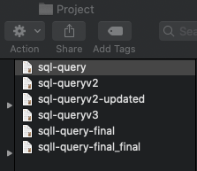
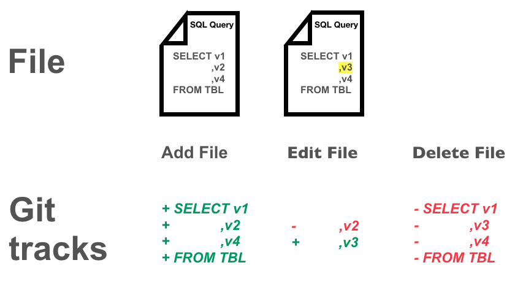
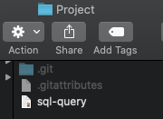
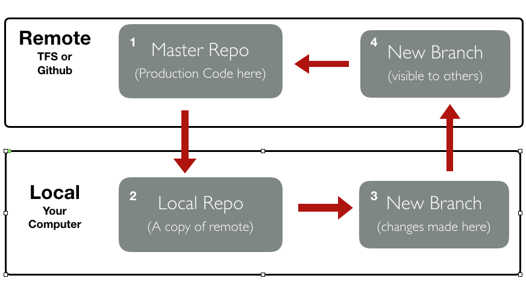

```{r setup, include=FALSE}
knitr::opts_chunk$set(echo = FALSE)
knitr::opts_chunk$set(fig.retina = 3, warning = FALSE, message = FALSE)

library(tidyverse)

```

class: title-slide, center, bottom

# `r rmarkdown::metadata$title`

### `r params$author`  |  `r params$date`

---

# Agenda

.pull-left[
1. Who is this person?

2. What is Git?

3. How does Git work?

4. How do I use git?

5. Common terms & questions.

6. A quick look at more advanced Git.

7. Materials & resources.
]

---

# Agenda

.pull-left[
1. Who is this person?

2. What is Git?

3. How does Git work?

4. How do I use git?

5. Common terms & questions.

6. A quick look at more advanced Git.

7. Materials & resources.
]

.pull-right[
<span class="orange-bold">Note: This presentation will cover the basics of using Git for Data Science.</span>

<span class="orange-bold"> It's target audience is those who aren't using Git regularly.</span>
]

---

# Who is this person?
.pull-left[

## Matt Leary

Data Scientist / Markel IM

Developer on Success Sorter team 

R enthusiast, Python user

]

.pull-right[

```{r, out.width="50%", fig.align='center'}
knitr::include_graphics('https://avatars2.githubusercontent.com/u/33221468?s=460&v=4')

```

]
---

# What is Git 

.pull-left[
Open source version control system 

Tracks changes to your code 

Share code/collaborate easily

Designed for <span class="orange-bold">software development</span>
]

---

# What is Git &emsp;&nbsp; &emsp;&nbsp; What it prevents

.pull-left[
Open source version control system 

Tracks changes to your code 

Share code/collaborate easily

Designed for <span class="orange-bold">software development</span>
]

.pull-right[

```{r out.width="75%"}

```

] 

---

# How does Git work?

It tracks changes to files

---

# How does Git work?

```{r out.width="90%", fig.align='center'}

```

---

# How does Git work?

.pull-left[
No more redundant code

```{r out.width="75%"}

```
]

.pull-right[
A hidden folder tracks changes

```{r out.width="75%"}

```
]

---

# How to use Git: Common workflow

```{r}

```

---

# Some common Git terms

---

# Some common Git questions
## Git vs Github

Git is an open source, version control system

Github is a service provider, that hosts git repositories

Some additional service providers:

*  Gitlab

*  Bitbucket

*  <span class="orange-bold">TFS/Azure DevOps</span>

---

# Some common Git questions
## What is the difference between saving and committing a file?

---

# Presentation materials & resources

.pull-left[
Presentation repo:

[github/mleary](https://github.com/mleary/git-intro)
]

.pull-right[

Additional resources:

[R-Ladies Git Tutorial*](http://brunaw.com/slides/git-workshop/git-workshop.html#1) 

[Github Resources](https://try.github.io)

[Git Cheatsheet](https://www.atlassian.com/git/tutorials/atlassian-git-cheatsheet)

[Free Udemy Couse](https://www.udemy.com/course/git-started-with-github/)

[Happy Git with R](https://happygitwithr.com)

]

